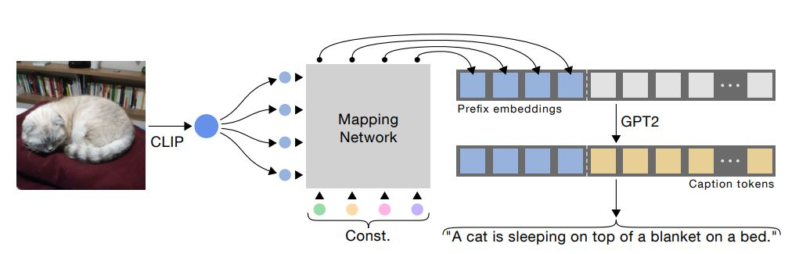
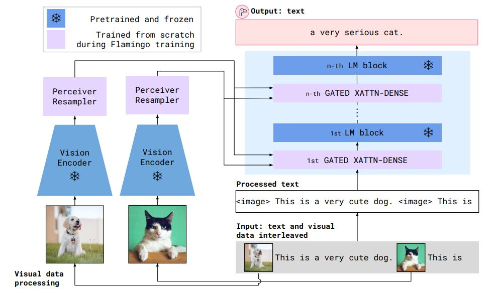
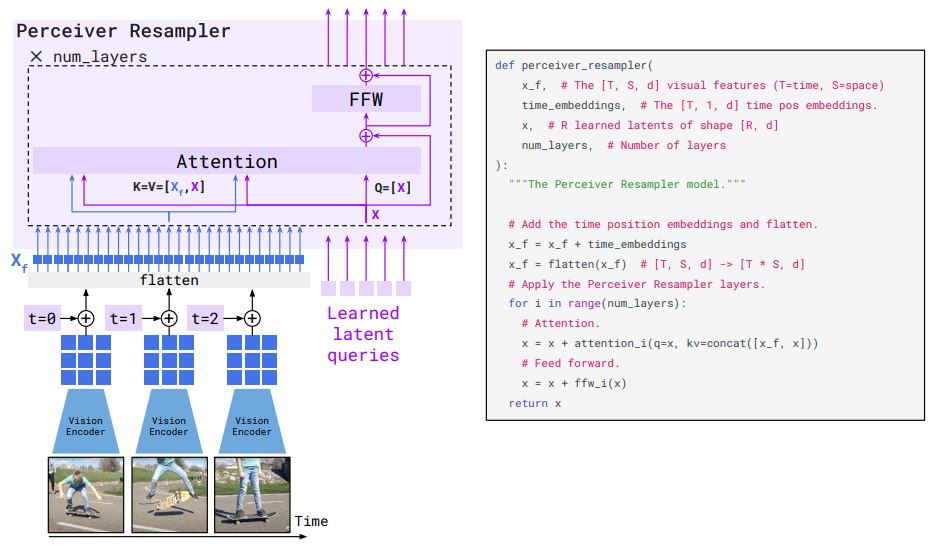
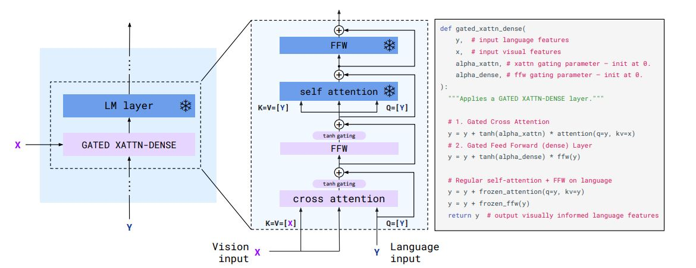
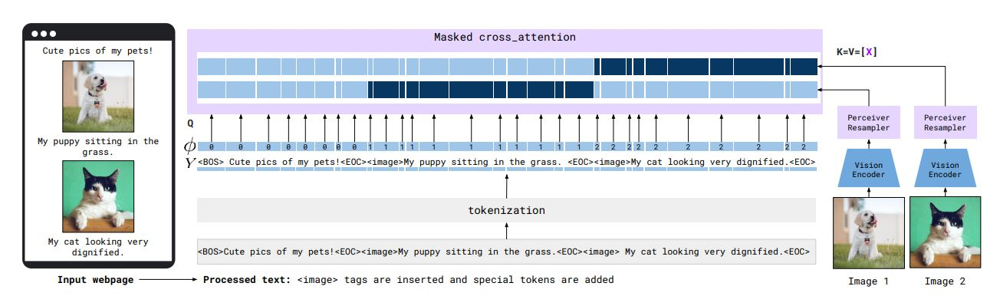

# VisualPretrainedLM
Some summary about the details of Pretrained Language Models and VisualPLMs. Because of the increasing size of the latest PLMs, the trend of multimodal architectures move away from encoder-decoder to a freezed/few-shot LM or understanding model plus a embedding space mapping module. This type of models are cheap, versitile and yet achieve good performance.  

## [BART](https://arxiv.org/pdf/1910.13461.pdf)
Motivation: To generalize the BERT/GPT to adapt to various tasks. 

Seq2seq strcuture:   
**Encoder**: Bi-directional encoder.  
**Decoder**: Autoregressive deocer, the first input token is BOS token (*<start>*). **Each layer of the decoder is corss-attended with the final hidden states of the encoder.** For fine-tuning, an uncorrupted document is input to both the encoder and decoder, and we use representations from the final hidden state of the decoder.
Pretrain tasks: Token masking/deletion, Sentence permutation, Document rotation, text infilling.  
 
Model Size: Base: 6 layers for both encoder and decoder. Dimension for each layer is 1024, total parameter number 130M. Large: 12 layers. 
 
Finetune methods: 
 - Seq classification: Same input to the encoder and decoder. The final hidden state of the decoder is passed to a linear classifier.
 - Token classification: Same input to the encoder and decoder. The hidden state of the last layer of the decoder is used for that corresponding token.
 - Seq Generation: Text input to the encoder, decoder generate in autoregressive manner.
 - MT: Additional randomly initialized encoder which translate the input language into noisy 'English', which is passed to the encoder as input. 

## ViT 
 
## [ClipCap](https://arxiv.org/pdf/2111.09734.pdf)  
 **Motivation**: Most models that deal with image captioning task follow the encoder-decoder structuere, which requires connections between visual and textual features and it is expensive. Therefore, it is desirable to develop a faster paradigm.  
 
 
 **Method**: Map the CLIP embedding to the textual embedding space with a fixed-length. Concate the caption embedding and the visual embedding. The training objective is to autoregressively predict the caption tokens conditioning on prefix.  
 Freeze the CLIP and the LM and only train the mapping network rather than fine-tuning the whole LM. The mapping network is MLP when LM is not freezed, while transformer is chosen when LM is freezed.  
 During inference, caption tokens are predicted based on the visaul embeddings. 
 
 **Difficulty**: **The transferring between CLIP features and LM features**, as their latent spaces are independent and a mapping network is needed. 

## Chinchilla

## [Flamingo](https://storage.googleapis.com/deepmind-media/DeepMind.com/Blog/tackling-multiple-tasks-with-a-single-visual-language-model/flamingo.pdf)
Tackling multiple tasks with a single visual language model. Design for few-shot set up. Take image, video, text as input prompt to generate text. Aim at video and image understanding.
 
**Model Structure**:  
 
 1. Vision encoder: NormalizerFree ResNet (NFNet), F6 model. Pretrain the vision encoder using a contrastive objective on our datasets of image and text pairs, using the two-term contrastive loss. 
 2. Perceiver Resampler: Maps varying-size large spatio-temporal feature maps to few fixed-length visual tokens. (Reduce the computational complexity of vision-text cross attention.) The perceiver has architecture of a transformer.  
 
 
 3. Interleaved visual data and text: Gated Cross-attention (XAtten-Dense) layers within a frozen pretrained LM (pretrained 70B Chichilla). Cross-attention layer is inserted for every 1, 4, 7 LM layers. Cross-attention layers take Vision input as K and V and Language input as Q. Tanh are used after cross attention and FFW to improve the robustness and performance.  
 
 
 4. Multi-image attention: During cross-attention layer, the K and V are masked such that text can only attend to the image that appears before it (the images corresponds to that piece of text.)  
 

**Training Dataset**: Flamingo is designed for general downstream tasks. Therefore it collect data with different nature, e.g. text-images pairs, video-image pairs and the MultiModal MassiveWeb (M3W) dataset (with a few pieces of text and images, text may or may not correspond to an image. Up to 5 images.). 

 **Key takeaways**: 
 1. Dataset is really important. M3W takes a major portion.
 2. Cross-attention contributes a lot, including the Gate mechanism and the insert frequency. (The more the merrier.)
 
**Model Size**: 800M parameters
